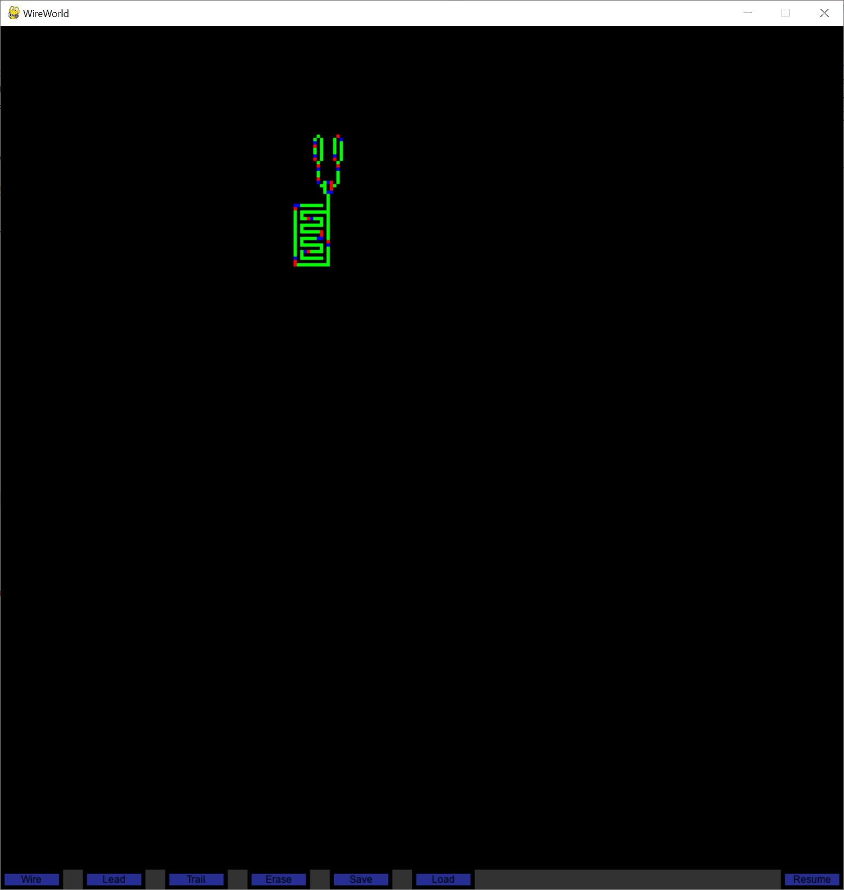

# WireWorldCL
WireWorld simulator written in Python

Features:
- OpenCL GPU accelerated simulation
- Load/Save functionality
- Basic editing capabilites

To use, run ```pip install -r requirements.txt```, and then run ```python WireWorldCL.py```. 
Alternatively, for Windows users, an exe is provided in the releases section of this repo.

This program uses OpenCL GPU acceleration to run the simulation. Consequently, you will need OpenCL on your machine. Check with your hardware manufacturer for drivers.


